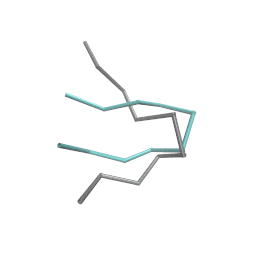

This repository contains an implementation of the methods and experiments presented in the paper ["Implicit Transfer Operator Learning: Multiple Time-Resolution Surrogates for Molecular Dynamics"](https://openreview.net/forum?id=1kZx7JiuA2&noteId=LH8F2ohaS0), reproducing results for Alanine Dipeptide. To replicate the results for fast-folding proteins, contact the authors of ["How Fast-Folding Proteins Fold"](https://www.science.org/doi/10.1126/science.1208351) to request access to the relevant data.



Animation of a simulation of Chignolin with the ITO framework, aligning it with an image of the folded protein in the background for reference. 

## Installation
Follow these steps to set up the environment and install the necessary dependencies for ITO.

### Cloning the Repository
Clone the repository and navigate to the project directory:

```
$ git clone https://github.com/olsson-group/ito
$ cd ito
```

### Installing Dependencies
To install the required dependencies, run:

```
$ make install-{arch}
```

Replace {arch} with your target architecture:

cpu for CPU-only installations.

cu118 for systems with CUDA 11.8.

cu121 for systems with CUDA 12.1.

This command will install all package dependencies and the appropriate wheels for pytorch-scatter, pytorch-sparse, pytorch, and pytorch-cluster, which are architecture-specific dependencies for pytorch-geometric.


## Usage
This section provides instructions on how to run simulations, train models, and reproduce the results presented in the paper. 


### Train a TLDDPM
To train a TLDDPM model, use the following command:

```
python scripts/train_tlddpm.py
```

This script comes with several arguments to customize training. To see all available arguments run:

```
python scripts/train_tlddpm.py --help
```

This command will display the following options:

```
optional arguments:
  -h, --help            show this help message and exit
  --root ROOT           Base directory for storing data and checkpoints.
  --n_features N_FEATURES
                        Number of features for the score model.
  --n_layers N_LAYERS   Number of layers in the score model.
  --epochs EPOCHS       Number of training epochs.
  --diff_steps DIFF_STEPS
                        Number of diffusion steps in the model.
  --batch_size BATCH_SIZE
                        Batch size for training.
  --lr LR               Learning rate for the optimizer.
  --max_lag MAX_LAG     Maximum lag to consider in the ALA2 trajectories.
  --fixed_lag           Enable to use a fixed lag value, disabled by default.
  --indistinguishable   Enable this flag to treat atoms as indistinguishable.
  --unscaled            Use unscaled data. When disabled, data is scaled to unit variance.
```

Upon completion of the training, a symbolic link to the model checkpoint with the lowest loss will be created at:

```
storage/train/{timestamp}/best
```

And a symlink to the directory for the latest train-session, including all checkpoints and arguments used for the run, will be created at 

```
storage/train/latest/
```

### Sampling from model
After training a model, trajectories can be generated by iteratively sampling the model. This is achieved by using the sample_tlddpm.py script.

To sample trajectories from a trained model, execute the following command:

```
python scripts/sample_tlddpm.py {checkpoint}
```

By default, if left blank, the last trained model will be used.

Replace {checkpoint} with the path to the checkpoint file of the model you wish to use for sampling. The script comes with several arguments to customize sampling. To see all available run:

```
python scripts/sample_tlddpm.py --help
```

This command will display the following options:

```
positional arguments:
  checkpoint            Path to the model checkpoint file for generating trajectories.

optional arguments:
  -h, --help            show this help message and exit
  --root ROOT           Base path for input data and where output samples will be stored.
  --samples SAMPLES     The number of initial positions to sample trajectories from, processed in parallel.
  --traj_length TRAJ_LENGTH
                        The total number of steps (frames) in each generated trajectory.
  --lag LAG             Temporal lag between consecutive steps (frames) in the generated trajectory.
  --ode_steps ODE_STEPS
                        Number of steps for the ODE solver during sampling. Set to 0 for normal denoising.
  --indistinguishable   Enable this flag to treat atoms as indistinguishable in the model.
  --unscaled            Enable this flag to use unscaled data. By default, data is scaled to have unit variance.
```

By default, the trajectories generated by this script are saved in the following location:

```
storage/samples/{timestamp}/trajectory.npy
```

And a symbolic link to the sampled trajectories will be create at:

```
storage/samples/latest
```


### Analyzing trajectory data
To run the analysis script on a trajectory execute the following command  

```
python scripts/analyze.py {trajectory_path}
```

This will automatically fetch the last generated trajectory. otherwise use the --traj argument to specify a path. The available flags and kw args can be seen by running 

```
python scripts/analyse_trajs.py --help
```

which will show the following options

```
positional arguments:
  trajs            Specify the path to the trajectory file containing the trajectories to be analyzed. Default is 'storage/samples/latest'. If the default path is unchanged, ensure

optional arguments:
  -h, --help       show this help message and exit
                   that the sampling script has been run prior to analysis.
  --root ROOT      Set the base directory where input data is located and where analysis outputs will be stored. The default directory is 'storage'. Modify this if your data and
                   output directories are different.
  --lag LAG        Define the temporal lag (in steps) between frames in the ITO trajectory. This value will be used to analyse the reference trajs such that time steps match. The
                   default value is 100.
  --no_plot_start  Include this flag to prevent marking the starting point of trajectories in the generated plots. By default, the starting point is marked. This should only be
                   used if the trajectories was generated with --init_from_eq
```

Running the script will calculate the VAMP2-scores of the trajectories as well as VAMP2-scores of the reference trajectories, calculated with the appropriate lag. 
It will also plot and save marginal plots of dihedral angles compared with reference data as well as ramachandran of samples.


To cite this work, please use the bibtex: 
```
@inproceedings{
    schreiner2023implicit,
    title={Implicit Transfer Operator Learning: Multiple Time-Resolution Models for Molecular Dynamics},
    author={Mathias Schreiner and Ole Winther and Simon Olsson},
    booktitle={Thirty-seventh Conference on Neural Information Processing Systems},
    year={2023},
    url={https://openreview.net/forum?id=1kZx7JiuA2}
}
```
